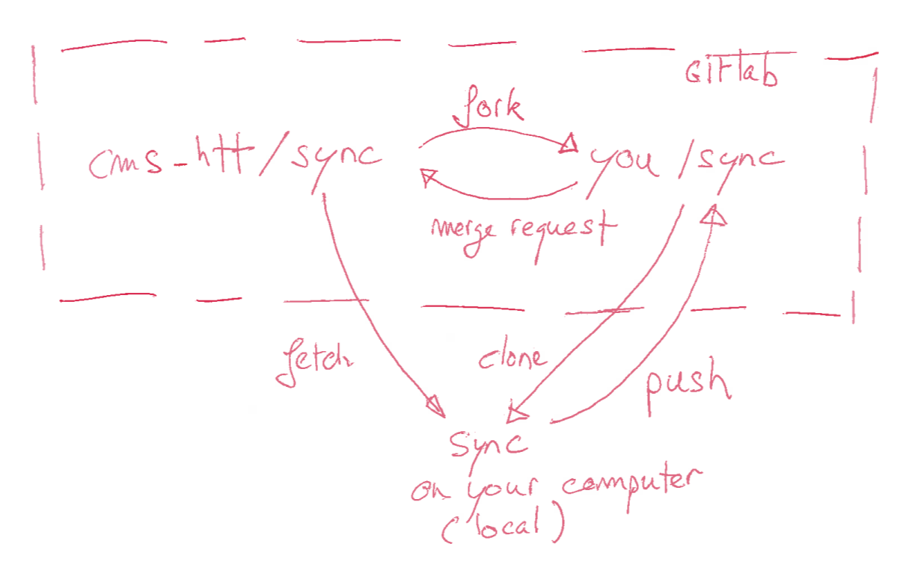
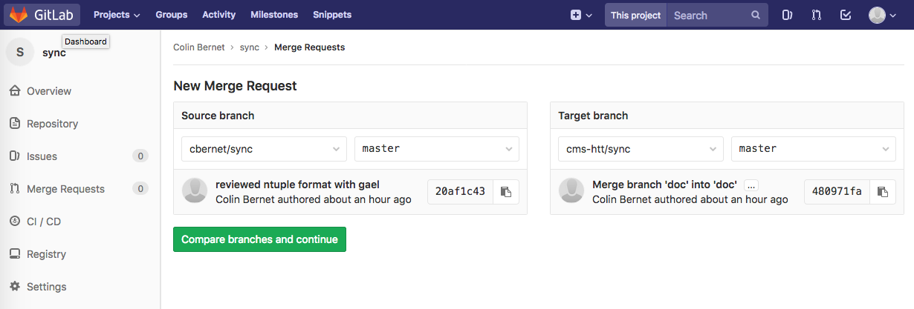

# Guidelines and tips for contributing to the documentation

This documentation is the basis for our synchronization and our analysis, and it is of utmost important to keep it up-to-date while modifying it in a very controlled way. That is the main reason why we decided to move the documentation to a git-based version controlled system.

## Markdown

The documentation is written in markdown, a lightweight markup language very similar to twiki. Here are a couple useful links: 

* [Markdown cheat sheet](https://github.com/adam-p/markdown-here/wiki/Markdown-Cheatsheet)
* Markdown editors provide immediate interpretation of your text: 
	* [MacDown](https://macdown.uranusjr.com/) (MacOS)
	* [Atom](https://atom.io/) (Other operating systems) 
	
		
## Workflow

Most of us are familiar with git, and with github- or gitlab- based development workflows, such as the development of CMSSW. We use the same kind of workflow to manage our analysis documentation. This workflow is illustrated on the figure below. Details and instructions to set up this workflow for you to contribute are given below. To follow these instructions, you need [basic knowledge of git]()



The main repository for our documentation is [https://gitlab.cern.ch/cms-htt/sync](https://gitlab.cern.ch/cms-htt/sync). That's where the latest version of the documentation can be obtained, and where you want to include your contributions. 

### set up your fork 

To be done only once.

Your fork is a copy of the sync repository that belongs to you. You can develop it freely and, when there are things you would like to change in [cms-htt/sync](https://gitlab.cern.ch/cms-htt/sync), you can do it through a *merge request* (called a pull request on github). 

To create your fork, do the following: 

* create an account on [https://gitlab.cern.ch](https://gitlab.cern.ch) if not already done. 
* go to [https://gitlab.cern.ch/cms-htt/sync](https://gitlab.cern.ch/cms-htt/sync)
* click the fork button 

In the following, we'll assume your gitlab username is `cbernet`

### set up your local repository 

To be done only once. 

The local repository is a copy of your fork located on your computer. To create your local repository, do the following: 

* go to your fork: [https://gitlab.cern.ch/cbernet/sync](https://gitlab.cern.ch/cbernet/sync)
* at the top of the page, below the name of the repository, click on KRB5 and change it to SSH. The fork adress should appear as [ssh://git@gitlab.cern.ch:7999/cbernet/sync.git]()
* copy this address, and type on the command line: 

```
git clone ssh://git@gitlab.cern.ch:7999/cbernet/sync.git
cd sync
```

### Improve the documentation

You can now start editing the files to improve the documentation. A few tips: 

* please commit often, trying to isolate individual changes in different commits. For example, if you want to modify the analysis ntuple and also to update the recipe for tau ID, these changes should be in different commits, e.g. with the following messages: 
	* "new naming scheme for VBF variables in the analysis ntuple"
	* "updated tau isolation working point to whateverVeryLongDiscriminatorNameYouCanThinkAbout"
* feel free to create new markdown files in the [doc/](.) directory. It is much easier to edit and read small files than a very large one.
* feel free to include images in the [doc/](.) directory whenever needed, as I did above. 

### Pushing your modifications to your fork

So far, your modifications were committed to your local repository. If you delete the repository directory, they are just gone forever.

So do not hesitate to push often to your fork, by doing: 

```
git push origin master
```

### Sharing your modifications 

Now that your changes have been ported to your fork, you're ready to do a merge request. 
This is requesting the administrators of [cms-htt/sync](https://gitlab.cern.ch/cms-htt/sync) to pick up one of your branches and merge it in a branch of [cms-htt/sync](https://gitlab.cern.ch/cms-htt/sync). 

To do the merge request: 

* click on the "merge requests" button at the very top right of the page
* select your repository and branch as the source, and make sure cms-htt/sync master is selected as target. It should look like this: 



* then click "Compare branches and continue". 
* check if there is any conflict. if not, create the merge request. if yes, go to next section. 


### Resolving conflicts

Conflicts are rare but can happen if somebody modified the same lines as you did while you were working, and managed to squeeze their merge request before yours. But you need not worry, conflicts are easy to solve. 

First, you'll need to add [cms-htt/sync](https://gitlab.cern.ch/cms-htt/sync) as a remote to your local repository. To do that, do: 

```
git remote add official ssh://git@gitlab.cern.ch:7999/cms-htt/sync.git
```

Get the newest version of the repository and merge its master branch into yours:

```
git pull official master
```

Then: 

* solve the conflicts (this might be a bit too fast, don't hesitate to ask for help on mattermost for example, or to contact Colin directly)
* push again to your fork
* create your merge request


